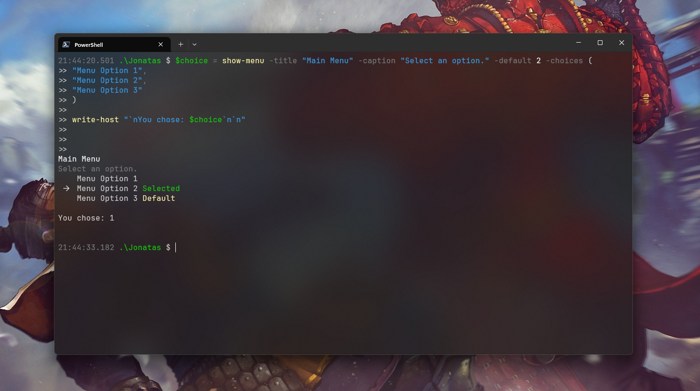

# InteractivePSMenu
## Description
Generates a dynamic console menu featuring a list of options, allowing users to navigate and select choices using their keyboard arrows.



<br><br>


## Documentation
`title  :` **[string/optional]**
<br>
	Title for the menu.
<br>
 Defaults: "`Please make a selection...`"

`caption:` **[string/optional]**
<br>
	Menu caption _(or title)_.
<br>
	Defaults: ""

`choices:` **[array/required]**
<br>
	List of choices to display in the menu.

`yselect:` **[string/optional]**
<br>
	Text to display when the cursor is on the selected option.
<br>
 Defaults: "` 🡢 `"

`nselect:` **[string/optional]**
<br>
	Text to display when the cursor is not on the selected option.
<br>
 Defaults: "`   `"

`default:` **[int/optional]**
<br>
	Index of the default option selected from the choices.
<br>
	**Don't forget that every array starts counting from zero.**
<br>
 Defaults: `0`

<br>

## Usage
``` powershell
# This example shows how to use the Show-Menu function to display a menu with a custom title and three options.
$choice = show-menu -title "Main Menu" -caption "Select an option." -default 2 -choices (
	"Menu Option 1",
	"Menu Option 2",
	"Menu Option 3"
)

write-host "`nYou chose: $choice`n`n"
```
